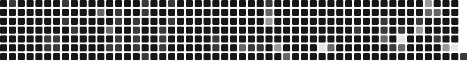

  

<h3 align="left">
  Full stack dev | Exploring GenAI & Agents | Pune 
</h3> 

---

<h2> About </h2>

        
 I ♥️ OSS and linux 
 
        
 Learning by shipping - APIs, Websites, and projects built from scratch 
    
        
 I spend my weekends attending hackathons and tech meetups 

---

<h2> Socials </h4> 

    
  
  
  
  
  

  ---

  
  

---

  

---

## Tech Stack

| Area | Technologies |
|------|-------------|
| **Languages** |        |
| **Frontend** |       |
| **Backend** |         |
| **Databases** |   |
| **Development & Build Tools** |     |
| **Deployment & Hosting** |    |
| **AI Tools & Agents** |      |
| **OS & VCS** |        |

---

  

        
